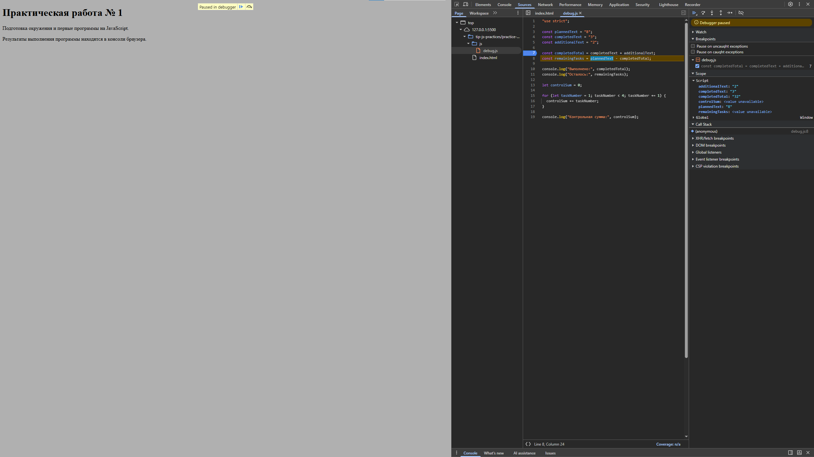

# Практическая работа № 1

## Автор и вариант

**Имя:** Беюсов Арслан Тимурович

**Группа:** ЭФБО-04-25

**Вариант:** 4

## Окружение

**ОС:** Windows 10

**Версия Node.js:** v24.21.0

**Версия npm:** 11.19.0

**Версия Git:** 2.55.0.windows.5

**Браузер:** Google Chrome 152.0.7977.85

## Запуск

Команды выполняются из корня репозитория:
```bash
node practice-01/js/hello.js
node practice-01/js/types.js
node practice-01/js/progress.js
node practice-01/js/plan.js
node practice-01/js/debug.js
```

Для браузера: открыть `practice-01/index.html`, заменить путь в script на нужный файл, сохранить изменения, перезагрузить страницу и посмотреть Console.

## Задание 1

Файл: `practice-01/js/hello.js`

**Node.js.** Результат в консоли терминале:

```
Студент: Беюсов Арслан Тимурович
Группа: ЭФБО-04-25
Практическая работа: 1
JavaScript успешно запущен
Тип document: undefined
```

**Браузер.** Результат в консоли DevTools:

```
Студент: Беюсов Арслан Тимурович
Группа: ЭФБО-04-25
Практическая работа: 1
JavaScript успешно запущен
Тип document: object
```

**Различие:** результат отличается только типом документа. При запуске через Node.js документ не предоставляется, поэтому возвращает `undefined`, а при запуске через html возвращает `object`.

## Задание 2

Файл: `practice-01/js/types.js`

| Выражение | Ожидание до запуска | Фактическое значение | Тип результата | Объяснение |
|---|---|---|---|---|
| `"8" + 2` | `"82"` | `"82"` | string | Для исходных строк оператор `+` выполняет конкатенацию — объединение текста |
| `"8" - 2` | `6` | `6` | number | Оператор `-` выполняет только математическое вычетание, поэтому строка преобразуется в число |
| `Number("8") + 2` | `10` | `10` | number | Функция `Number()` преобразует строку в число |
| `"12" > "3"` | `false` | `false` | boolean | Строки при сравнении между собой сравниваются как строки, а не как числа |
| `	12 === "12"` | `false` | `false` | boolean | Строгое равенство не преобразует операнды разных типов к общему типу |
| `Number("")` | `0` | `0` | number | Пустая строка преобразуется в 0 |
| `Number("text")` | `NaN` | `NaN` | number | Строка не является числом |
| `	Boolean("false")` | `true` | `true` | boolean | Логическое преобразование не интерпретирует текст как команду |
| `typeof null` | `"object"` | `"object"` | string | Особые случаи: `typeof null` возвращает `"object"` |
| `typeof NaN` | `"number"` | `"number"` | string | `typeof NaN` возвращает `"number"` |


## Задание 3

Файл: `practice-01/js/progress.js`

| Проверка | Входные данные | Ожидаемый результат | Фактический результат | Итог |
|---|---|---|---|---|
| Свой вариант | 20, 11 | Осталось 9; прогресс 55.0%; статус «В работе». | Всего задач: 20 Выполнено: 11 Осталось: 9 Прогресс: 55.0 % Статус: В работе | Пройдено |
| Обычный случай | 12, 5 | Осталось 7; прогресс 41.7%; статус «В работе». | Всего задач:  12 Выполнено: 5 Осталось: 7 Прогресс: 41.7 % Статус: В работе | Пройдено |
| Нет задач | 0, 0 | Сообщение «Задач пока нет», без расчёта процента. | Задач пока нет | Пройдено |
| Ничего не выполнено | 5, 0 | Осталось 5; прогресс 0.0%; статус «Не начато». | Всего задач: 5 Выполнено: 0 Осталось: 5 Прогресс: 0.0 % Статус: Не начато | Пройдено |
| Все выполнено | 5, 5 | Осталось 0; прогресс 100.0%; статус «Завершено». | Всего задач: 5 Выполнено: 5 Осталось: 0 Прогресс: 100.0 % Статус: Завершено | Пройдено |
| Выполнено больше | 5, 6 | Ошибка: выполнено больше, чем существует. | Ошибка: выполнено больше, чем существует. | Пройдено |
| Отрицательное число | -1, 0 | Ошибка: отрицательное количество. | Ошибка: отрицательное количество. | Пройдено |
| Дробное число | 5, 2.5 | Ошибка: дробное количество. | Ошибка: дробное количество. | Пройдено |
| Некорректные данные | "5", 2 | Ошибка: вместо числа передана строка. | Ошибка: вместа числа передан другой тип данных. | Пройдено |
| Превышение границы | 1001, 0 | Ошибка: превышена верхняя граница. | Ошибка: превышена верхняя граница. | Пройдено |
| Недопустимое значение | NaN, 0 | Ошибка: недопустимое числовое значение. | Ошибка: недопустимое числовое значение. | Пройдено |

## Задание 4

Файл: `practice-01/js/plan.js`

| Проверка | Входные данные | Ожидаемый результат | Фактический результат | Итог |
|---|---|---|---|---|
| Свой вариант | 20, 11, 3 | 3 дня, по 3 задачи в день. | День 1 : выполнено 3 , осталось 6 День 2 : выполнено 3 , осталось 3 День 3 : выполнено 3 , осталось 0 Потребуется дней:  3 | Пройдено |
| Обычный случай, неравное распределение задач в день | 12, 5, 3 | 3 дня; в последний день выполнена 1 задача. | День 1 : выполнено 3 , осталось 4 День 2 : выполнено 3 , осталось 1 День 3 : выполнено 1 , осталось 0 Потребуется дней:  3 | Пройдено |
| Обычный случай, равное распределение задач в день | 10, 4, 3 | 2 дня, по 3 задачи в день. | День 1 : выполнено 3 , осталось 3 День 2 : выполнено 3 , осталось 0 Потребуется дней:  2 | Пройдено |
| Обычный случай, норма больше числа оставшихся задач | 5, 3, 10 | 1 день, выполнено только 2 оставшиеся задачи. | День 1 : выполнено 2 , осталось 0 Потребуется дней:  1 | Пройдено |
| Все выполнено | 5, 5, 2 | 0 дней; цикл не выполняется. | Все задачи уже выполнены. Потребуется дней: 0 | Пройдено |
| Нет задач | 0, 0, 2 | 0 дней; цикл не выполняется. | Задач пока нет Потребуется дней: 0 | Пройдено |
| Дневная норма меньше 1 | 5, 2, 0 | Ошибка; цикл не запускается. | Ошибка; цикл не запускается. | Пройдено |
| Дробная дневная норма | 5, 2, 1.5 |Ошибка: дробной дневной нормы быть не должно. | Ошибка: дробной дневной нормы быть не должно. | Пройдено |
| Выполнено больше | 5, 6, 2 | Ошибка: некорректное число выполненных задач. | Ошибка: некорректное число выполненных задач. | Пройдено |
| Некорректные данные | 5, 2, "2" | Ошибка: дневная норма задана строкой. | Ошибка: дневная норма задана не числом. | Пройдено |
| Превышение границы нормы | 5, 2, 1001 | Ошибка: превышена верхняя граница нормы. | Ошибка: превышена верхняя граница нормы. | Пройдено |

## Задание 5

Файл: `practice-01/js/debug.js`

**Исходный вывод:**

```bash
Выполнено: 32
Осталось: -24
Контрольная сумма: 6
```

Результат неверный, но программа не выдала ни одного исключения



| Ошибка | Что наблюдалось | Причина | Исправление | Результат после исправления |
|---|---|---|---|---|
| Обработка количества задач | `completedTotal = "32"` | Оператор `+` выполнял конкатенацию, так как работал со строками | `const completedTotal = Number(completedText) + Number(additionalText); const remainingTasks = Number(plannedText) - completedTotal;` | `Выполнено: 5 Осталось: 3` |
| Граница цикла | `controlSum = 6` (сумма 1 + 2 + 3 ) | Условие `taskNumber < 4` не включает задачу 4 | for (let taskNumber = 1; taskNumber <= 4; taskNumber += 1) | `Контрольная сумма: 10` |

**Вывод после исправлений:**

```bash
Выполнено: 5
Осталось: 3
Контрольная сумма: 10
```

## Вывод

В ходе практической работы №1 я подготовил рабочее окружение (Node.js, npm, Git, браузер), организовал Git-репозиторий, освоил запуск одного и того же JavaScript-файла в браузере и через Node.js, научился различать эти среды выполнения. Теперь я умею пользоваться const, let, основными типами данных, преобразованием типов, условиями и циклами в языке JavaScript. Я проверял различные входные данные, а так же применял консоль и точку останова в DevTools браузера.